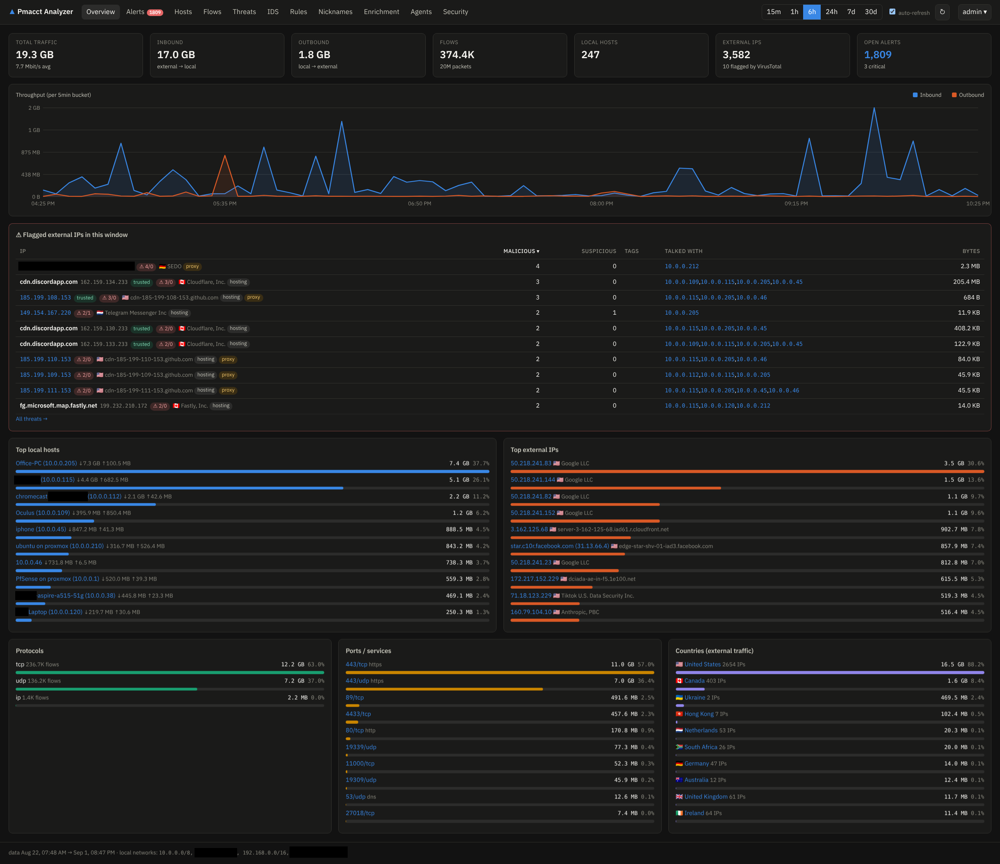
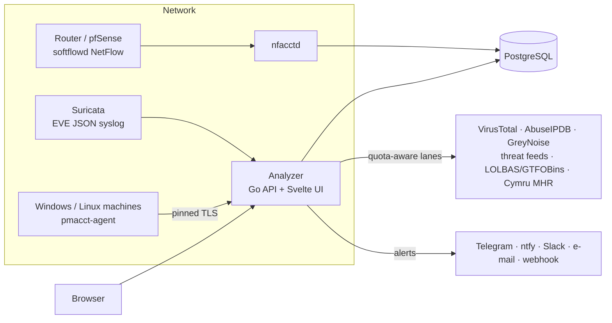

# Pmacct-Suricata Analyzer

A self-hosted network traffic analyzer for your home lab or small network: **pmacct** flow
accounting, **Suricata** IDS events, threat-intel enrichment (VirusTotal, AbuseIPDB, GreyNoise,
abuse.ch feeds), a detection-rules engine with Telegram/ntfy/Slack/e-mail notifications — and
**endpoint agents** for Windows and Linux that tell you *which program* opened each connection.

## What it does

- **See every flow** your router exports (NetFlow/sFlow via `nfacctd`): per-host pages, ports,
  protocols, peers, hourly history, top talkers.
- **Know who you are talking to**: every external IP is enriched with rDNS, ASN, geo,
  hosting/proxy flags, VirusTotal, AbuseIPDB and GreyNoise reputation, and matched against
  threat feeds (Feodo, ThreatFox, Spamhaus DROP, Tor exits, CINS, …).
- **Get alerted**: built-in and custom (SQL) detection rules raise alerts with severity,
  delivered to Telegram, ntfy, Gotify, Slack, webhooks or e-mail. Trusted-list exclusions,
  per-IP notes and nicknames keep the noise down.
- **Ingest Suricata**: EVE JSON over syslog shows IDS events next to the flows that caused them.
- **Attribute connections to programs**: a small Rust agent (Windows service / systemd unit,
  pinned-TLS, eBPF or socket-table capture) reports *per minute, per program, per destination*
  counts — so an alert says `via chrome.exe (petro)` instead of just an IP.
- **Explain any program** deterministically — no LLM, no search engines: built-in + user
  knowledge base, the owning package and signature checked **on the machine itself**, VirusTotal
  file reports and Team Cymru MHR by hash, LOLBAS/GTFOBins catalogues, beacon detection, and
  OS-specific verification commands.

## Architecture

Everything runs from one `docker compose` file: PostgreSQL, `nfacctd`, and the analyzer image
(Go backend + built frontend + cross-compiled agent binaries).

## Where to start

- **[Getting started](getting-started.md)** — deploy the stack with Docker Compose and log in.
- **[pfSense: NetFlow & Suricata](tutorials/pfsense.md)** — point softflowd and Suricata at the analyzer.
- **[Endpoint agents](tutorials/agents.md)** — one-liner install on Windows and Linux.
- **[Alerts & notifications](tutorials/alerts.md)** — rules, severities, Telegram setup.

