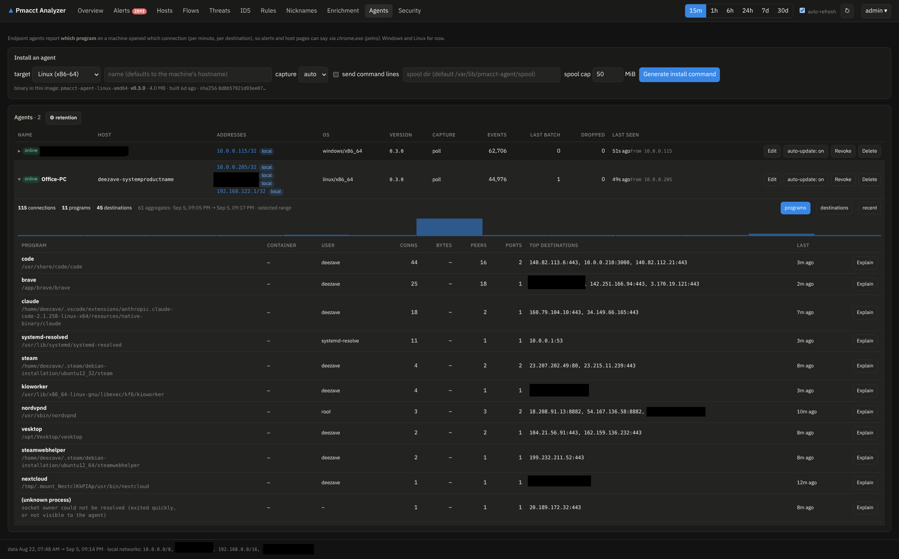
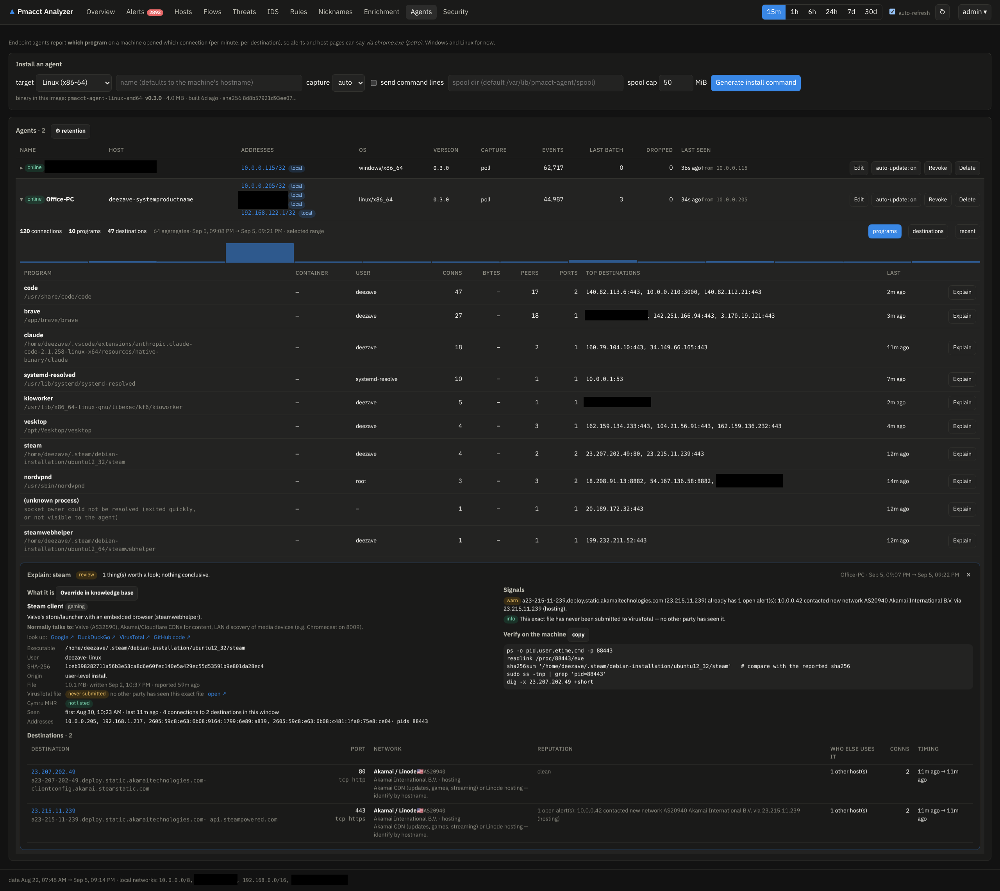

# Endpoint agents

pmacct sees *which machine* talked to *which peer*. An endpoint agent on a Windows or Linux
machine adds *which program*: host pages get a **Programs** table, alerts say
`via chrome.exe (petro)`, and every program gets an [Explain](explain.md) button.

The agent is a small Rust binary (~4 MB, static). It reports **per minute, per (program, user,
destination, port, protocol) counts** — no payloads, no command lines unless you opt in.

## Prerequisite: HTTPS

Agent traffic is token-authenticated, so it must never cross the LAN in clear. Set:

```bash
TLS_LISTEN_ADDR=:8091
TLS_HOSTS=10.0.0.210        # names/IPs the certificate must cover
```

The analyzer creates an internal CA, and agent endpoints refuse plain HTTP once TLS is
configured. Agents pin the CA's public key (`--ca-pin`), installers verify the CA fingerprint
shown by the UI before trusting anything.

## Installing

**Agents** page → *Install an agent*: pick the OS, capture backend, spool location/cap, whether
command lines are reported — then *Generate install command*. This mints a single-use
enrollment token (valid 24 h) and shows a one-liner.



=== "Linux"

    ```bash
    # as root; fetches the CA, verifies its fingerprint, downloads the checksum-verified
    # binary from the analyzer itself, enrolls, installs a systemd unit
    curl -sk https://10.0.0.210:8091/api/v1/agent/install.sh | sudo bash -s -- \
      --server https://10.0.0.210:8091 --token <TOKEN> \
      --ca-fingerprint <AA:BB:…> --ca-pin <base64> --capture auto
    ```

=== "Windows"

    Paste the generated command into an **administrator PowerShell** (Windows PowerShell 5.1
    and PowerShell 7 both work — and it must be PowerShell, not `cmd`). It loads the installer
    function over TLS, verifies the CA fingerprint, imports the CA into the machine's trusted
    roots, downloads and checksum-verifies the agent, enrolls it and registers the service.

## Capture backends

| Backend | How | Notes |
|---|---|---|
| `ebpf` (Linux) | eBPF programs on the root cgroup's `connect4/6` + `sendmsg4/6` hooks | catches **every** connection at the instant it happens; needs root, cgroup v2, kernel ≥ 5.8 |
| `poll` | reads the OS socket table every second (`/proc/net` + `/proc/*/fd`, `GetExtendedTcpTable`) | portable; sub-second connections can be missed |
| `auto` | ebpf if it loads, else poll | the default |

```bash
# quickest way to check a machine: live attributed connections for 10 s
sudo pmacct-agent snapshot --capture ebpf --seconds 10
```

Rootless-container traffic is attributed too: when `pasta`/`slirp4netns` proxies a connection,
the agent matches the destination against the containers' own socket tables and labels it
`pasta.avx2 → web-app`.

## What the agent knows about each program

The first time an executable is seen (agent ≥ 0.3) its identity facts are reported once:
SHA-256/SHA-1/MD5, and

- **Linux**: the owning package (dpkg/apk/pacman — plain file reads, nothing executed),
  whether the file **still matches the package manifest**, or the install channel: snap,
  flatpak, AppImage, Nix, container image, venv, home, Downloads, `/tmp`, *unpackaged*;
- **Windows**: the **Authenticode** verdict (embedded or catalog signature), signer, and the
  version resource (company / product / version).

```bash
# see exactly what would be reported for any file
pmacct-agent identify /usr/bin/curl
```

All of it feeds the [Explain](explain.md) panel and its signals.

## Day-2 operation

- **Activity view**: click an agent to see its programs, destinations and timeline for the
  selected window.
  
- **Auto-update**: the server advertises the agent build it ships; agents update themselves
  over the pinned connection (checksum + self-test, previous binary kept as `.old`) when the
  global switch (*⚙ retention*) and the per-agent switch allow. Manual: `pmacct-agent update`
  (`--force` reinstalls).
- **Spool**: batches are spooled on disk while the server is unreachable — location and cap
  (default 50 MiB) are set at install (`--spool-dir`, `--spool-max-mb`).
- **Retention**: agent data is kept 15 days by default; *⚙ retention* on the Agents page also
  lets you forget agents that have been silent for N days.
- **Revoke / delete**: per-agent actions on the Agents page invalidate the token immediately.
