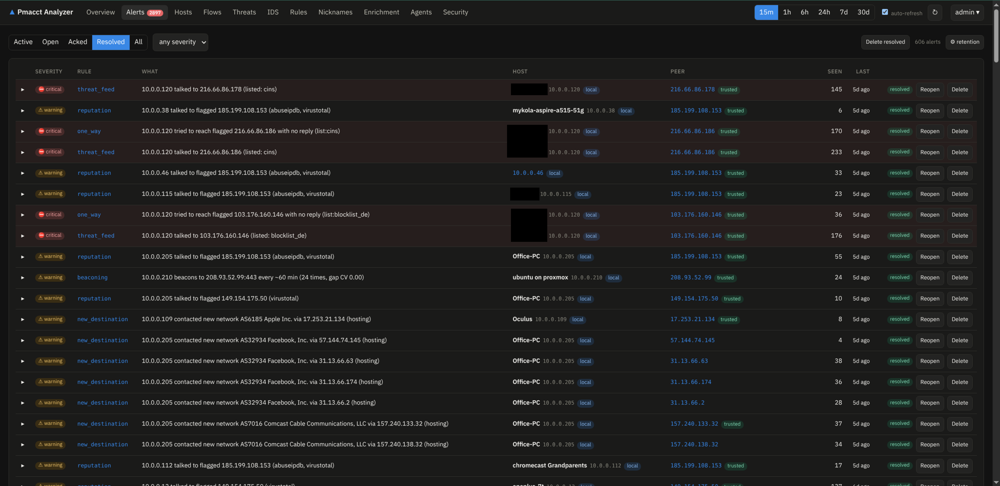
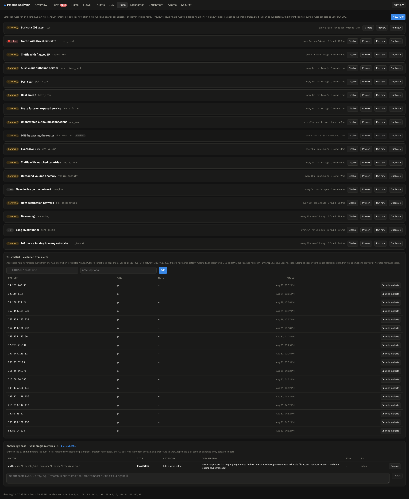

# Alerts & notifications

## Rules

The rules engine (`RULES_ENABLED=true`, evaluated every `RULES_INTERVAL`) ships with built-in
detections — threat-list hits, VT-flagged peers, beaconing, DNS anomalies, traffic spikes — and
lets you change everything on the **Rules** page:

- **enable/disable, severity, evaluation interval and window** per rule;
- **custom rules**: clone a built-in rule's logic or write a SQL rule that returns
  `host, peer, port` rows — each row raises (or refreshes) an alert;
- alerts carry `via <program> (<user>)` context when an [endpoint agent](agents.md) covers the
  host.

## Keeping the noise down

- **Trusted list**: the shield button next to any IP (host pages, alerts, threats) excludes an
  IP, CIDR or hostname pattern from **all** alerting; the Rules page manages the list. Trusted
  peers also never raise Explain signals.
- **Nicknames & notes**: name your devices (`petro-laptop` instead of `192.168.1.23`) and keep
  a per-IP journal; names appear in notifications too.
- **Un-resolve / delete**: alerts can be re-opened if resolved by mistake, and resolved alerts
  deleted manually.
- **Retention**: resolved alerts are deleted per-severity after a configurable time
  (default: info after 7 days) — the ⚙ on the Alerts page.

## Notifications

Any subset of channels, configured by environment:

| Channel | Variables |
|---|---|
| Telegram | `NOTIFY_TELEGRAM_TOKEN`, `NOTIFY_TELEGRAM_CHAT_ID` |
| ntfy | `NOTIFY_NTFY_URL` |
| Gotify | `NOTIFY_GOTIFY_URL`, `NOTIFY_GOTIFY_TOKEN` |
| Slack | `NOTIFY_SLACK_WEBHOOK_URL` |
| Generic webhook | `NOTIFY_WEBHOOK_URL` |
| E-mail | `NOTIFY_SMTP_*` |

Delivery policy: **minimum severity** (default `critical`; changeable live on the Enrichment
page), optional digest window (`NOTIFY_DIGEST`), quiet hours (`NOTIFY_QUIET_HOURS=23-7`),
re-notify interval, and a **Send test** button. Messages include nicknames and the peer's
enrichment context (rDNS/ASN/geo/threat status), plus a `PUBLIC_URL` link back to the alert.

### Telegram in two minutes

1. Talk to [@BotFather](https://t.me/BotFather) → `/newbot` → copy the token into
   `NOTIFY_TELEGRAM_TOKEN`.
2. **Send `/start` to your new bot** from your account (a bot cannot message you first).
3. Get your chat id: `https://api.telegram.org/bot<TOKEN>/getUpdates` → `chat.id` →
   `NOTIFY_TELEGRAM_CHAT_ID`.
4. Restart the analyzer, press **Send test** on the Enrichment page.

!!! note "`telegram: http 400`"
    A 400 from the test button means the chat id is wrong or you never sent `/start` to the
    bot — the error body in the analyzer log says which.
