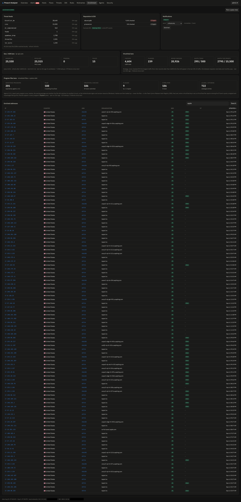

# Enrichment & threat intel

Everything on this page runs inside the analyzer process as quota-aware background lanes; the
**Enrichment** page shows each lane's status, quotas and failures.

## IP lanes

| Lane | Source | Notes |
|---|---|---|
| geo | ip-api.com (keyless), ipinfo.io (`IPINFO_TOKEN`), or **local MaxMind GeoLite2** (`GEOIP_CITY_DB`/`GEOIP_ASN_DB` — pfBlockerNG already downloads these) + reverse DNS | hostname, country, ASN, org, hosting/proxy flags |
| VirusTotal | `VT_API_KEY` | engine counts, reputation, tags; free-tier limits respected (4/min, 500/day, 15.5k/month) |
| AbuseIPDB / GreyNoise | `ABUSEIPDB_KEY` / `GREYNOISE_KEY` | confidence score / scanner classification |

Candidates are picked frugally: only external IPs seen in the last `ENRICH_LOOKBACK` (24 h),
never-checked-first ordered by traffic, refresh only while still active, exponential backoff on
failures, and daily/monthly budgets counted **in the database** so restarts never overspend.

## Threat feeds

`THREAT_FEEDS` (bulk IP/CIDR lists, refreshed hourly) defaults to abuse.ch Feodo + ThreatFox,
Spamhaus DROP, Tor exit nodes, CINS, ET compromised and blocklist.de. Matches show on hosts,
threats and alerts; feeds that disappear from the config stop matching immediately.

## File intelligence (hash look-ups)

For every executable an [endpoint agent](agents.md) (≥ 0.3) reports, the **hash** — never the
file — is looked up:

- **Team Cymru Malware Hash Registry**: a DNS TXT query, free, keyless
  (`MHR_ENABLED=true` by default);
- **VirusTotal file reports** (when `VT_API_KEY` is set): engine counts, threat label, the
  names the file is known under, signers, first submission — sharing the IP lane's daily
  quota, unsigned/unpackaged files first. A hash VirusTotal has *never seen* is recorded as
  such — that fact alone is a useful signal.

## LOLBAS / GTFOBins catalogues

The [LOLBAS](https://lolbas-project.github.io/) (Windows) and [GTFOBins](https://gtfobins.org/)
(Unix) catalogues of legitimate-but-abusable system binaries are refreshed daily
(`LOLBAS_URL`, `GTFOBINS_URL`; empty disables). [Explain](explain.md) uses them to identify and
flag programs like `certutil.exe` or an unexpected outbound `curl` — with the abusable
functions and MITRE technique ids.

!!! info "Privacy"
    Outbound traffic from the analyzer is limited to: the enrichment APIs you gave keys for,
    the feeds/catalogue downloads, DNS (rDNS + MHR), and your notification channels. Agent
    data never leaves the analyzer; file contents never leave the machines.
