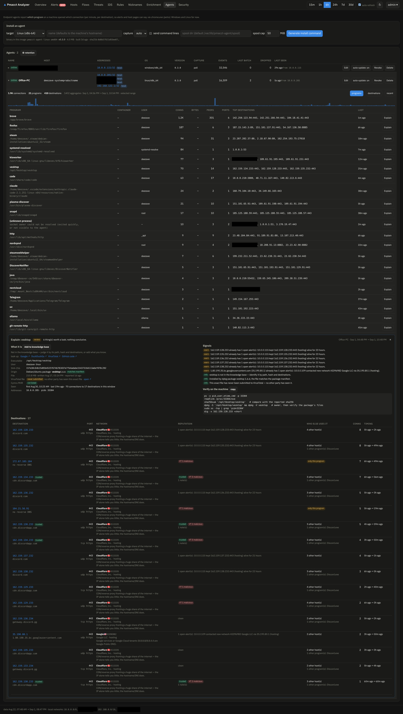

# Explain: what is this program?

Every program on a host page or in an agent's activity has an **Explain** button. It turns what
the analyzer already knows into a deterministic write-up — no LLM, no search engines, nothing
leaves your network except keyed hash look-ups you enabled.

## What goes into a report

| Section | Source |
|---|---|
| **What it is** | built-in knowledge base (browsers, container proxies like `pasta`/`passt`, runtimes, package managers, Windows components, living-off-the-land binaries) → overridden by **your** knowledge-base entries → filled in from the LOLBAS/GTFOBins catalogues |
| **Origin / Signature** | facts the agent gathered on the machine: owning package + manifest check (Linux), Authenticode verdict + signer + version resource (Windows), install channel (snap, flatpak, AppImage, `/tmp`, Downloads, unpackaged…) |
| **VirusTotal file / Cymru MHR** | hash look-ups (never the file itself): engine counts, threat label, names the file is known under, first submission; MHR listing with detection rate |
| **Destinations** | per peer: rDNS + learned names, ASN/org classified into infrastructure (CDN, cloud, hosting, ISP…), threat lists, VT/reputation, open alerts, Suricata events, notes, who else on the LAN talks to it, beacon-like timing |
| **Signals + assessment** | everything above condensed into `expected` / `review` / `suspicious` with the reasons ranked |
| **Verify on the machine** | copy-pasteable, OS-specific commands (`dpkg -V`, `pacman -Qkk`, `Get-AuthenticodeSignature`, `ss -tnp`, …) |

Signals worth knowing:

- *file differs from the package manifest*, *signature INVALID*, *hash listed by MHR*, *≥3 VT
  engines* → **critical**;
- *unsigned*, *no package owns this file*, *runs from Temp/Downloads*, *beacon-like timing*,
  *never submitted to VirusTotal* (for an unsigned/unpackaged file) → **warning**;
- container attribution: connections proxied by rootless-Podman's `pasta` are pinned to the
  actual container, so the report explains the *container's* traffic, not the proxy.

## Extending the knowledge base

When Explain meets a program it cannot identify, add your own entry: **Add to knowledge base**
in the panel. Entries match by executable path (glob), program name (glob) or SHA-256, and take
precedence over the built-in list. Manage, import and export them on the **Rules** page
(`GET /api/v1/kb?export=1` gives you a JSON you can commit somewhere).

The panel also offers plain look-up links (Google, DuckDuckGo, VirusTotal, GitHub code search,
LOLBAS/GTFOBins entry) — nothing is sent until you click.

## The unknown-process group

Sockets whose owning process the agent could not resolve (exited between two polls, another
namespace) are grouped as *(unknown process)* — Explain still reports their destinations and
suggests switching the agent to eBPF capture, which attributes at `connect()` time.
