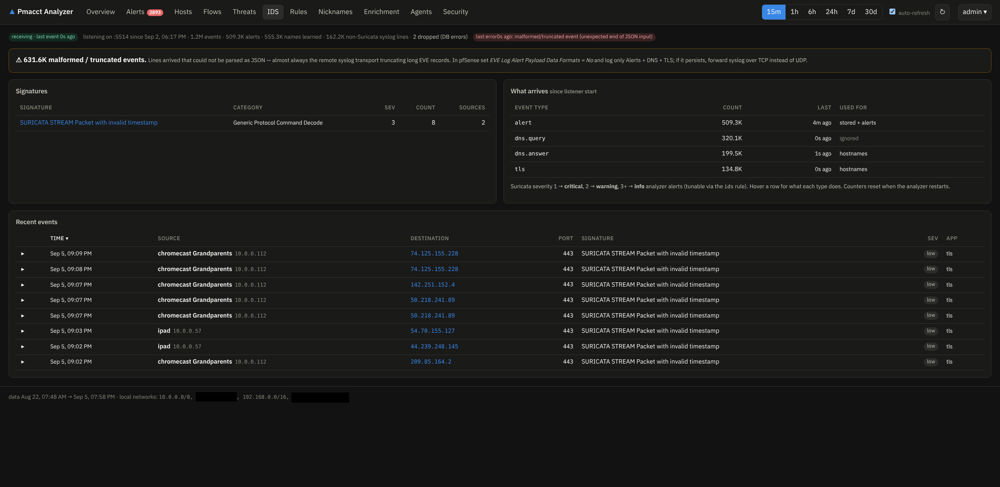
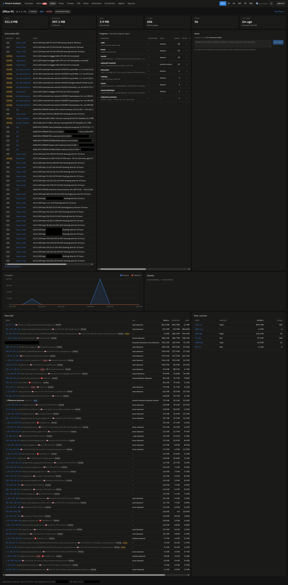

# pfSense: NetFlow & Suricata

How to feed the analyzer from a pfSense router — flow export with **softflowd**, IDS events
from the **Suricata** package. Any other router or exporter that speaks NetFlow v5/v9/IPFIX or
sFlow works the same way; only the pfSense clicks differ.

Throughout, `10.0.0.210` stands for the analyzer host.

## 1. Flow export with softflowd

1. Install the **softflowd** package (System → Package Manager).
2. Services → softflowd:
    - **Interface**: the interface whose traffic you want accounted. Pick **LAN** to see
      per-device traffic with local addresses; on **WAN** everything has already been NATed to
      your public IP.
    - **Host**: `10.0.0.210`, **Port**: `2055` (the `nfacctd` port from
      `deploy/docker-compose.yaml`).
    - **Version**: 9 (or 5).
3. Save. Flows appear on the Overview page within a minute or two — softflowd exports a flow
   when it expires, so an idle network takes a moment.

!!! warning "Capturing on WAN?"
    If you export from the WAN side, add your public address to `LOCAL_NETWORKS`
    (e.g. `LOCAL_NETWORKS=192.168.0.0/16,10.0.0.0/8,203.0.113.7/32`), or all of your own
    traffic is classified as external.

Verify packets are arriving on the analyzer host:

```bash
sudo tcpdump -ni any udp port 2055 -c 5
```

No packets → check the softflowd settings and any firewall rules between router and analyzer;
softflowd only sends once flows expire, so generate some traffic and wait a minute.

## 2. Suricata EVE events over syslog

The analyzer accepts Suricata's EVE JSON over syslog on `SURICATA_LISTEN` (e.g. `:5514`, UDP).

1. In `deploy/analyzer.env` set `SURICATA_LISTEN=:5514` and restart the analyzer.
2. pfSense → Services → Suricata → your interface → **EVE Output Settings**:
    - EVE JSON Log: enabled, output type **SYSLOG** (not FILE), facility `LOCAL1`, priority `notice`.
3. pfSense → Status → System Logs → Settings → **Remote Logging Options**:
    - Enable remote logging, remote log server `10.0.0.210:5514`,
      and send at least the *Firewall events* / *everything* selection that includes the
      Suricata facility.
4. The **IDS** page shows the listener status (`listening on :5514`), the event counter, and
   the latest events; per-host pages list the IDS events for that address.

!!! warning "Malformed / truncated events? It's UDP syslog truncation."
    FreeBSD's syslog daemon **truncates forwarded messages to ~480 bytes**, so long EVE records
    (alerts carrying app-layer metadata especially) arrive as cut-off JSON and the IDS page
    reports *malformed / truncated events*. Fix, easiest first:

    - **Shrink the records**: EVE Log Alert details → **uncheck "Include App Layer metadata"**
      (and packet dump / additional HTTP data); keep **EVE Log Alert Payload Data Formats = No**;
      log only Alerts + DNS + TLS. Save and restart Suricata.
    Shrinking the records is enough on most setups. Note that pfSense CE's **remote logging is
    UDP-only** (Status → System Logs → Settings shows no TCP option — it *"sends UDP datagrams"*),
    and "Remote Syslog Contents" should stay on **Everything** (Suricata rides the `LOCAL1`
    facility; the category checkboxes don't include IDS, so narrowing it stops forwarding
    Suricata — the analyzer simply ignores the other lines). If long DNS/TLS lines still
    truncate, send EVE to a **file** and run a shipper that forwards whole lines over **TCP** to
    `10.0.0.210:5514` — the analyzer listens on `:5514` over both UDP and TCP and reassembles
    full lines over TCP. (The malformed counter is cumulative and only resets when the analyzer
    restarts — watch whether it stops climbing, not the total.)



Test it end to end from a LAN machine (triggers the classic ET policy rule):

```bash
curl -s http://testmyids.com
```

!!! tip "Keep EVE on SYSLOG only"
    With output type FILE (or BOTH), Suricata also writes every event to local log files on the
    router that you don't need — the analyzer already stores everything. Keep the output type on
    SYSLOG only, and enable **Services → Suricata → Logs Mgmt → Auto Log Management** so any
    local logs stay rotated. (Separately, pfSense's GUI *Logs Browser* can crash with a PHP
    out-of-memory error — that's a bug in that page, not a disk problem; see
    [Troubleshooting](../reference/troubleshooting.md). View events on the analyzer's IDS page
    instead.)

!!! note "Nothing arriving?"
    `sudo tcpdump -ni any udp port 5514 -c 5` on the analyzer host tells you whether pfSense is
    sending at all. If tcpdump sees lines but the IDS page counts 0 events, the payload is not
    EVE JSON — re-check the EVE output type is **syslog** (not file) on the Suricata interface.

## 3. What you get

- Overview: totals, top talkers, protocols, countries, threats.
- Hosts → a LAN device: peers, ports, hourly profile, alerts, IDS events —
  and, with an [endpoint agent](agents.md), the programs behind the connections.


